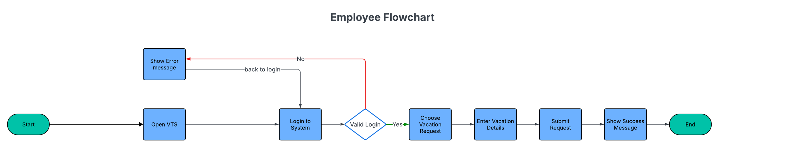
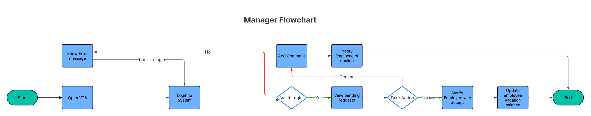
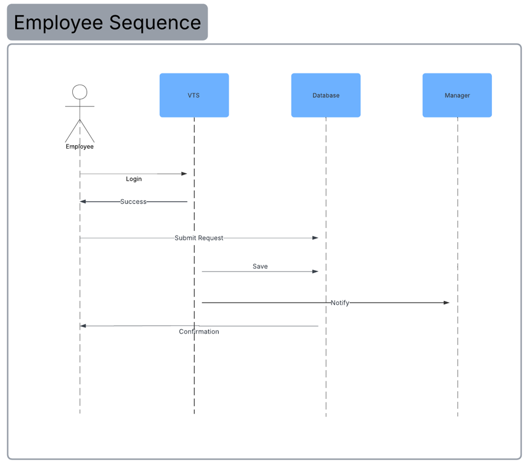
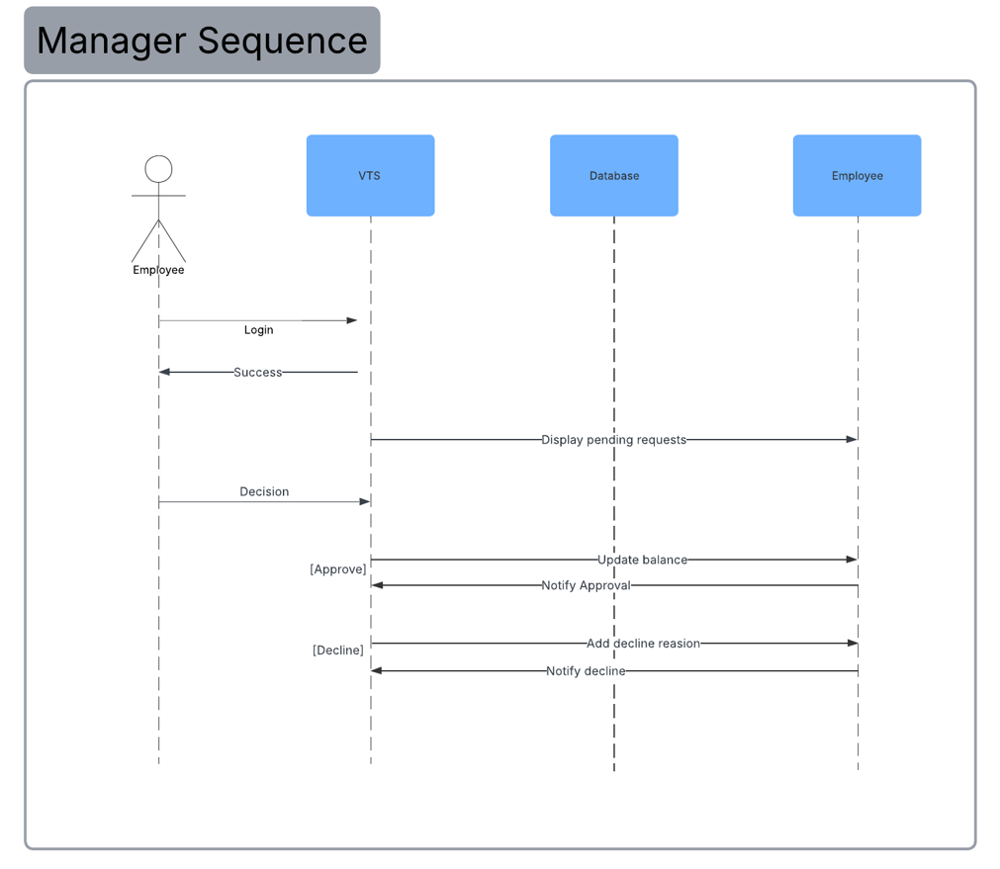
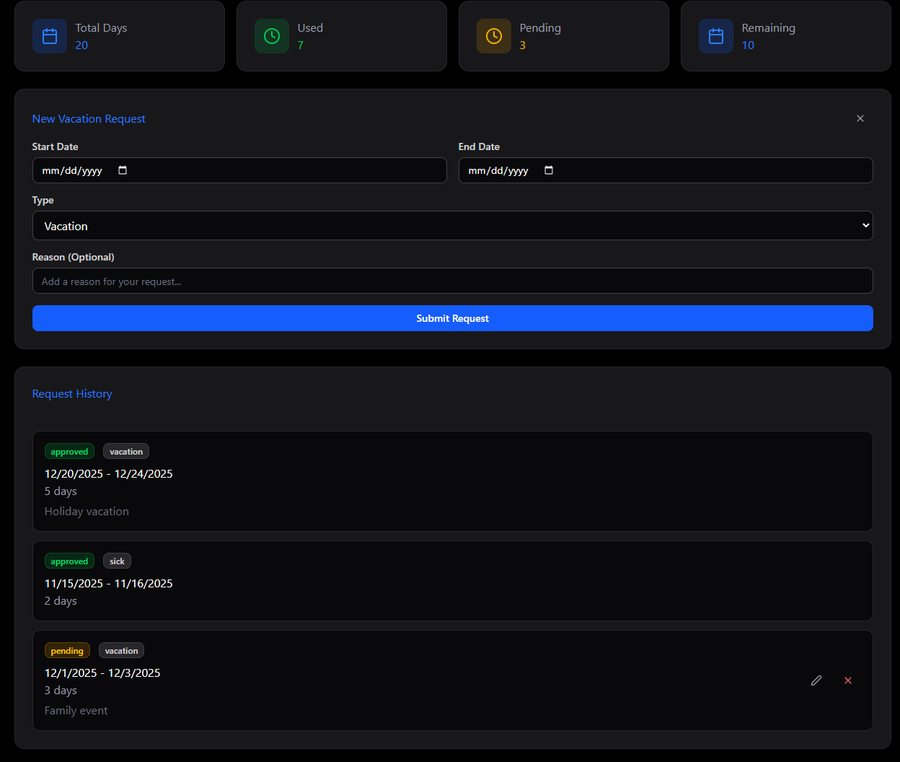
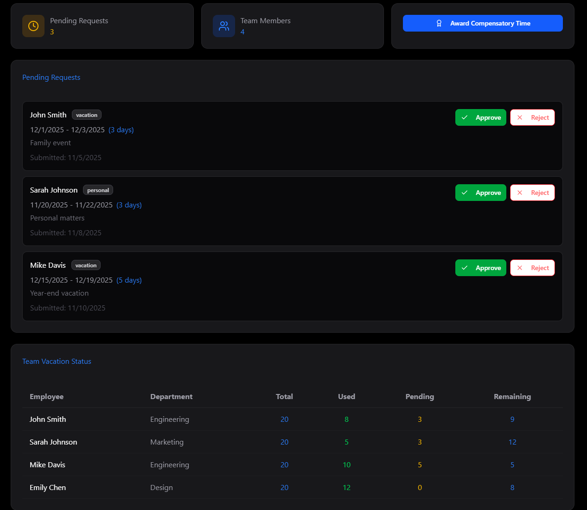
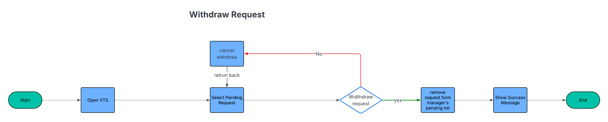
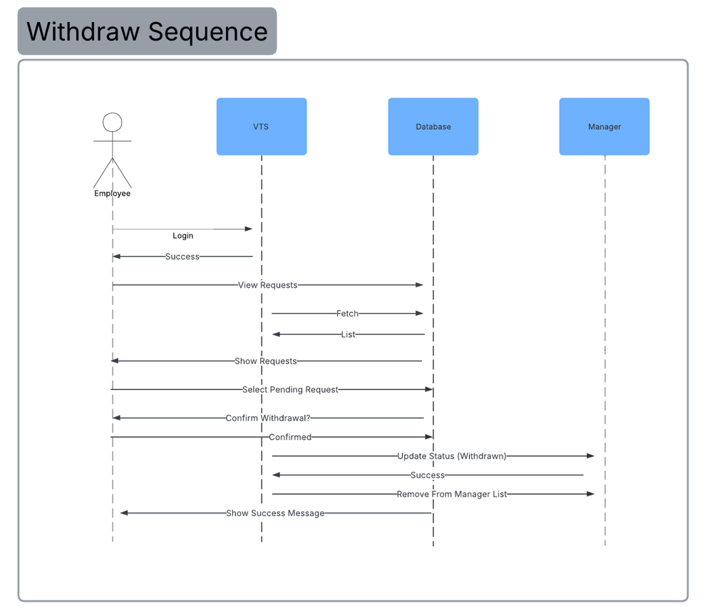

### Vision
Main vision is ease the use of vacation requests by automating the employee leave management process by reducing time and automate approval workflow instead of old manual one with fast, reliable and digital solution

---
### Functional Requirements
- Employees can submit, edit, and cancel vacation requests.
- System validates requests based on available balance and company rules.
- Managers can approve or reject vacation requests.
- Certain employees can have requests auto-approved.
- HR clerks can override or adjust requests when needed
- Email notifications are sent for all status changes.
- Employees and managers can view vacation history and balances.
- System integrates with existing HR systems for employee data.
- All actions are logged for auditing.

---
### Non-Functional Requirements
-  Must use single sign-on (SSO) for authentication.
-  All data changes must be logged for audit purposes.
-  The interface should be simple and usable by all employees.
-  Leave rules should be configurable without code changes.
-  Must ensure data security and role-based access control.

---

### Constraints
-  Must integrate with the current HR legacy system.
-  Must use the company’s email server for notifications.
-  Must follow existing authentication through SSO.

---

### Domain Definition
currently, the vacation approval process is slow and inefficient. Employees submit vacation requests manually via emails which first goes to the immediate managers then checked by HR which leads to wasting time and approval may take several days across departments.
The organization needs a **Vacation Tracking System** to automate and speed up the process of handling vacation requests. The goal is to improve internal workflow and reduce manual work.

---

### Actors and Responsibilities
| Actor            | Description                             | Responsibilities                                                                                                          |
| ---------------- | --------------------------------------- | ------------------------------------------------------------------------------------------------------------------------- |
| **Employee**     | Regular system user.                    | - Submit vacation requests<br>- View vacation balance and history<br>- Cancel or modify pending requests                  |
| **Manager**      | Employee with subordinates.             | - Approve/reject requests<br>- Award compensatory time (within limits)<br>- View subordinates’ vacation status            |
| **HR Clerk**     | HR staff responsible for employee data. | - Maintain employee records<br>- Approve requests when manager approval is skipped<br>- Override or adjust leave balances |
| **System Admin** | Technical administrator.                | - Maintain system uptime and integrations<br>- Manage logs and backups<br>- Configure access and security settings        |

---

## **Use Case - Manage Time**

##### **Actors:** Employee, Manager, HR Clerk 
**Goal:** Submit new vacation request and approve it through manager

#### A. Core Entities
| Entity                             | Description                                         | Key Fields                                                                                                  |
| ---------------------------------- | --------------------------------------------------- | ----------------------------------------------------------------------------------------------------------- |
| **Employee** _(reference from HR)_ | Represents the person submitting/approving requests | `employee_id`, `name`, `email`                                                                              |
| **LeaveRequest**                   | The vacation request record                         | `request_id`, `employee_id`, `start_date`, `end_date`, `status`, `total_days`, `submitted_at`, `manager_id` |
| **Approval**                       | Stores actions from Manager or HR Clerk             | `approval_id`, `request_id`, `approver_id`, `role`, `action`, `action_date`, `remarks`                      |
| **AuditLog**                       | Tracks all system actions                           | `log_id`, `actor_id`, `action_type`, `entity`, `entity_id`, `timestamp`                                     |

---

#### B. Flowcharts

##### 1- Employee Flowchart

##### 2- Manager Flowchart


---

#### C. Sequence Diagram




---
#### D. Pseudocode

1- Employee Pseudocode
```sql
BEGIN

  DISPLAY "Open Vacation Tracking System (VTS)"
  LOGIN(username, password)

  IF NOT valid_login THEN
      DISPLAY "Invalid credentials, please try again"
      GOTO LOGIN
  ENDIF

  DISPLAY "Vacation Request Form"
  INPUT start_date, end_date, reason

  IF start_date or end_date is invalid THEN
      DISPLAY "Invalid date selection"
      GOTO Vacation_Request_Form
  ENDIF

  SUBMIT vacation_request(start_date, end_date, reason)

  SAVE vacation_request TO database
  SEND request TO manager_for_approval

  DISPLAY "Your vacation request has been submitted successfully"

END
```

2- Manager Pseudocode
```sql
BEGIN

  DISPLAY "Open Vacation Tracking System (VTS)"
  LOGIN(username, password)

  IF NOT valid_login THEN
      DISPLAY "Invalid credentials, please try again"
      GOTO LOGIN
  ENDIF

  DISPLAY "Pending vacation requests list"

  FOR EACH request IN pending_requests DO
      DISPLAY request.details

      INPUT manager_decision ("Approve" or "Decline")

      IF manager_decision == "Approve" THEN
          APPROVE request
          UPDATE employee_vacation_balance(request.employee)
          NOTIFY employee("Your request has been approved")

      ELSE IF manager_decision == "Decline" THEN
          INPUT decline_reason
          ADD_COMMENT(request, decline_reason)
          NOTIFY employee("Your request has been declined")
      ENDIF
  ENDFOR

  DISPLAY "All pending requests processed"
  END

END
```

---

#### Initially UI Screens (Employee & Manager)

##### 1- Employee Screen View


##### 2- Manager Screen View


___

#### A Performance Question

**Question:** What if we need to have in the future another status like HR_Pending, HR_Approval
 with minimum change? 
--
 **Answer:**  In my opinion, best solution for this case is to create separate table with name `Vaction Status` and if we need to add new status in the future will just simply and new one in the table with its name and id.

**Submit A Request Pseudocode:**
```sql
FUNCTION SubmitVacationRequest(employee_id, start_date, end_date):

    // Step 1: Validate employee and dates (same as before)
    VALIDATE employee_id, start_date, end_date

    // Step 2: Get "Pending" status dynamically
    status_id = Database.selectOne(
        "VacationStatus",
        where = { status_name: "Pending" }
    ).status_id

    // Step 3: Insert request with status_id
    request_id = Database.insert(
        "LeaveRequest",
        {
            employee_id: employee_id,
            start_date: start_date,
            end_date: end_date,
            total_days: calculateBusinessDays(start_date, end_date),
            status_id: status_id,
            submitted_at: NOW()
        }
    )

    RETURN "Vacation request submitted successfully with status: Pending"
END FUNCTION
```

**Approving / Updating a Request Pseudocode:**
```sql
FUNCTION UpdateRequestStatus(request_id, new_status_name, approver_id):

    // Step 1: Get status_id dynamically
    status_record = Database.selectOne(
        "VacationStatus",
        where = { status_name: new_status_name }
    )

    IF status_record IS NULL THEN
        RETURN "Error: Invalid status name"
    ENDIF

    // Step 2: Update LeaveRequest with the new status
    Database.update(
        "LeaveRequest",
        request_id,
        { status_id: status_record.status_id }
    )

    // Step 3: Log the change
    AuditLog.record(
        actor_id = approver_id,
        action_type = "Status Update to " + new_status_name,
        entity = "LeaveRequest",
        entity_id = request_id,
        timestamp = NOW()
    )

    RETURN "Request status updated to " + new_status_name
END FUNCTION
```

___

## Use Case - Withdraw Vacation Request

**Actor:** Employee
**Goal:** Withdraw a pending vacation request via `employee`

#### A. Flow Chart


#### B. Sequence Diagram
]]